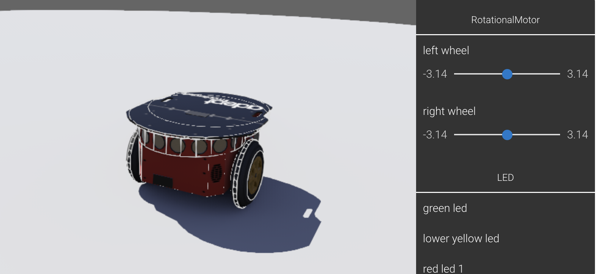

# ROS-Pioneer3DX-PS3Controller


Picture taken from: <https://cyberbotics.com/doc/guide/pioneer-3dx>

The goal of this project was to control a [Pioneer3DX robot](https://cyberbotics.com/doc/guide/pioneer-3dx) with a PS3 controller.

For this project, we run ROS on a Ubuntu development computer and connect to the Pioneer3DX with Rosaria. On the Ubuntu machine we also connect a PS3 controller.

Make sure you first configure your Pioneer 3DX and connect it to your Wifi network. Your development computer or onboard computer should also be on the same Wifi.

## Getting Started

Clone this repository

```bash
git clone https://github.com/waseemhnyc/ROS-Pioneer3DX-PS3Controller
```

Move into the clone repo, build and source the project and then grant project.py the required permissions.

```bash
cd ROS-Pioneer3DX-PS3Controller
catkin_make
source devel/setup.bash
chmod +X src/project/scripts/project.py
```

Download and source (`source devel/setup.bash`) the following packages:

- Rosaria: `https://github.com/amor-ros-pkg/rosaria`

- Rosaria Client: `https://github.com/pengtang/rosaria_client`

- Joystick Drivers: `https://github.com/ros-drivers/joystick_drivers`

Now in separate terminals run the following:

Terminal 1:

```bash
roscore
```

Terminal 2:

```bash
rosrun rosaria RosAria __port:={IP_ADDRESS}:8101
rosrun rosaria RosAria __port:=192.168.0.1:8101
```

Terminal 3:

```bash
rosrun joy joy_node
```

Terminal 4:

```bash
rosrun project 3dx_joy_stick_controller
```

## Questions or Get in Touch

- Twitter: <https://twitter.com/waseemhnyc>
- Email: <waseemh.nyc@gmail.com>
